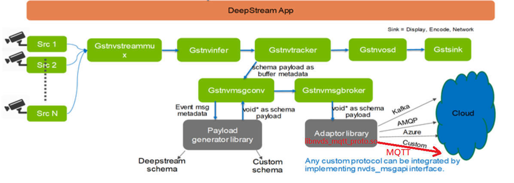
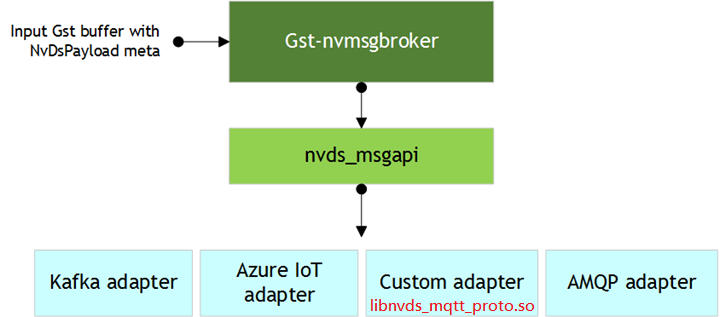
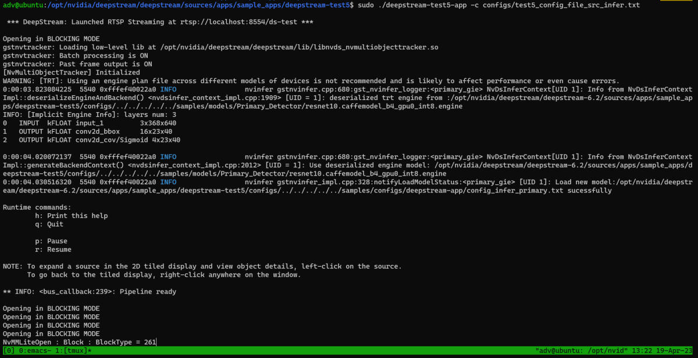
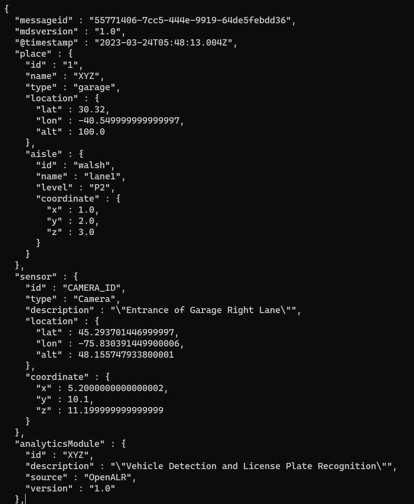

# README_mqtt_test5
**nvds\_msgapi MQTT Adapter Usage by deepstream-test5**

**Revision History**
--------------------

|     |     |     |     |
| --- | --- | --- | --- |
| **0.1** | **Date** | **Revision** | **Description** |
|     | 2023/4/19 | 0.1 | initial version |

* * *

**I. Purpose**
--------------

This document will describe how to use Advantech's proprietary MQTT protocol adapter with the sample deepstream-test5 application. At the same time, the inferred metadata associated with the video source can be retrieved via the RTSP stream.

* * *

**II. Messaging Function Block**
--------------------------------

We provide MQTT adaptor `**libnvds_mqtt_proto.so**` for MQTT protocol, integrated by implementing the nvds\_msgapi interface. Gst-nvmsgconv/nvmsgbroker metadata generation and messaging to cloud are explained by Figure 1.

### Figure 1 DeepStream App adaptor library messaging to cloud



DeepStream messaging interface, `nvds_msgapi`, is provided to implement a custom protocol message handler and integrate it with DeepStream applications. Such a message handler, known as a protocol adapter, let us integrate DeepStream applications with backend data sources, such as data stored in the cloud.

Our MQTT protocol adapter is based on Eclipse Paho MQTT C client library: [https://github.com/eclipse/paho.mqtt.c](https://github.com/eclipse/paho.mqtt.c)

Figure 2 show the relationship among Gst-nvmsgbroker, nvds\_msgapi and protocol adapters.

### Figure 2 DS plugin gst-nvmsgbroker nvds msgapi



**III. Prerequisites**
----------------------

JetPack-5.1 GA is required to successfully run and use the DeepStream on Jetson SDK. JetPack, including the latest L4T release, is available for download at:  
[https://developer.nvidia.com/embedded/jetpack](https://developer.nvidia.com/embedded/jetpack)

After downloading the installer, follow the steps mentioned in SDK Manager document to flash the L4T image to your target system. The SDK Manager document is available for download at:  
[https://docs.nvidia.com/sdk-manager/index.html](https://docs.nvidia.com/sdk-manager/index.html)

### III.1 Additional components required on the target

To successfully use the DeepStream SDK, the following additional components must be installed and set up on the target system:

*   CUDA (11.4)
*   TensorRT (8.5.1.1)
*   OpenCV (4.1.1)

Install these packages using JetPack SDK Manager.

### III.2 Installing prerequisite software on Jetson development board

Packages to be installed:

```text-plain
$ sudo apt-get install \
   libssl1.1 \
   libgstreamer1.0-0 \
   gstreamer1.0-tools \
   gstreamer1.0-plugins-good \
   gstreamer1.0-plugins-bad \
   gstreamer1.0-plugins-ugly \
   gstreamer1.0-libav \
   gstreamer1.0-alsa \
   libgstrtspserver-1.0-0 \
   libjansson4 \
   libyaml-cpp-dev
```

**IV. Get nvds\_msgapi\_mqtt adaptor**
--------------------------------------

Clone the `nvds_msgapi_mqtt` repo at user home directory:

```text-plain
cd ~
sudo git clone https://github.com/Advantech-EdgeX/nvds_usage.git
```

This will create the following directory: `~/nvds_msgapi_mqtt`

**V. nvds\_msgapi\_mqtt/setup.sh online help**
----------------------------------------------

```text-plain
-a|--mqtt_payload (0)Deepstream schema (1)Minimal (256)Reserved (257)Custom
-f|--config       sample_apps configure
-h|--help         show this help text
-m|--mqtt_host    MQTT broker IP address
-o|--output       Graphic display type - 1=FakeSink 2=EglSink 3=File
-p|--mqtt_port    MQTT broker port number
-r|--rtsp         RTSP streaming
-s|--sample       sample_apps folder name, Ex. deepstream-test5
-t|--mqtt_topic   MQTT broker topic
-u|--src_id       source id
   --src_enable   source enable or disable
   --src_type     Type of source; other properties of the source
                  1=Camera(V4L2) 2=URI 3=MultiURI 4=RTSP 5=Camera(CSI)
   --src_num      Number of sources. Valid only when type=3.
   --src_uri      URI to the encoded stream. The URI can be a file, an HTTP URI,
                  or an RTSP live source. Valid when type=2 or 3. With MultiURI,
                  the %d format specifier can also be used to specify multiple sources.
                  The application iterates from 0 to num-sources 1 to generate the actual URIs.
                  Ex. file://../../../../../samples/streams/sample_1080p_h264.mp4
   --src_cam_width         Width of frames to be requested from the camera, in pixels. Valid when type=1 or 5. Ex. 640
   --src_cam_height        Height of frames to be requested from the camera, in pixels. Valid when type=1 or 5. Ex. 480
   --src_cam_fps_n         Numerator part of a fraction specifying the frame rate requested by the camera, in frames/sec. Valid when the type=1 or 5. Ex. 30
   --src_cam_fps_d         Denominator part of a fraction specifying the frame rate requested from the camera, in frames/sec. Valid when type=1 or 5. Ex. 1
   --src_cam_v4l2_dev_node Number of the V4L2 device node. For example, /dev/video<num> for the open source V4L2 camera capture path. Ex. 0
--display_rows    Number of rows in the tiled 2D array.
--display_columns Number of columns in the tiled 2D array.
```

**VI. Install related components**
----------------------------------

In the `nvds_msgapi_mqtt/` directory, execute the following commands to install related components:

```text-plain
sudo ./setup.sh -s deepstream-test5 --install
```

It will install the following:

*   `eclipse/paho.mqtt.c` version 1.3.10
*   `libgstreamer-plugins-base1.0-dev libgstreamer1.0-dev libgstrtspserver-1.0-dev libx11-dev libjson-glib-dev`
*   build `deepstream-test5`
*   `<DeepStream 6.2 ROOT>/lib/libnvds_mqtt_proto.so`

**VII. Config deepstream-test5**
--------------------------------

### VII.1 Edit `configs/test5_config_file_src_infer.txt` manually

Please reference `nvds_msgapi_mqtt/sources/apps/sample_apps/deepstream-test5/configs/test5_config_file_src_infer.txt`.

### VII.2 Using `nvds_msgapi_mqtt/setup.sh` 

Let us take an example to explain how to use the script setup.sh to configure the `deepstream-test5` configuration. Execute the following three commands in sequence to update `configs/test5_config_file_src_infer.txt`.

```text-plain
sudo ./setup.sh -s deepstream-test5 --config -o 1 --rtsp \
-m 172.22.24.84 -p 1883 -t AnalyticsData \
--display_rows 2 --display_columns 2
```

```text-plain
sudo ./setup.sh -s deepstream-test5 --config \
--src_id 1 --src_enable 1 --src_type 3 --src_num 2 \
--src_uri file://../../../../../samples/streams/sample_1080p_h264.mp4
```

```text-plain
sudo ./setup.sh -s deepstream-test5 --config \
--src_id 0 --src_enable 1 --src_type 3 --src_num 2 \
--src_uri file://../../../../../samples/streams/sample_1080p_h264.mp4
```

The meanings of the above three command options are as follows:

*   Option -o|--output 1

```text-plain
[sink0]
enable=1
#Type - 1=FakeSink 2=EglSink 3=File
type=1 
....
```

*   Option --rtsp

```text-plain
[sink3]
enable=1
#Type - 1=FakeSink 2=EglSink 3=File 4=RTSPStreaming
type=4
#1=h264 2=h265
codec=1
sync=0
bitrate=4000000
rtsp-port=8554
udp-port=5400
```

*   Options -m mqtthost -p 1883 -t AnalyticsData

```text-plain
[sink1]
enable=1
#Type - 1=FakeSink 2=EglSink 3=File 4=UDPSink 5=nvdrmvideosink 6=MsgConvBroker
type=6
....
msg-broker-proto-lib=/opt/nvidia/deepstream/deepstream/lib/libnvds_mqtt_proto.so
#Provide your msg-broker-conn-str here
msg-broker-conn-str=172.22.24.84;1883;AnalyticsData
topic=AnalyticsData
```

*   Options --display\_rows 2 --display\_columns 2

```text-plain
[tiled-display]
enable=1
rows=2
columns=2
....
```

*   Options --src\_id 0 --src\_enable 1 --src\_type 3 --src\_num 2 --src\_uri file://….
*   Options --src\_id 1 --src\_enable 1 --src\_type 3 --src\_num 2 --src\_uri file://….

```text-plain
[source0]
....
[source1]
....
```

**VIII. Run deepstream-test5**
------------------------------

In `<DeepStream 6.2 ROOT>/sources/apps/sample_apps/deepstream-test5/` directory:

```text-plain
sudo ./deepstream-test5-app -c configs/test5_config_file_src_infer.txt
```

### Figure 3 test5 Execution console log snapshot



**IX. RTSP video streaming**
----------------------------

Prepare VLC to receive deepstream-test5 RTSP video streaming

```text-plain
rtsp://${jetson_ip}:8554/ds-test
```

, where ${jetson\_ip} is the Jetson device IP address.

### Figure 4 VLC display RTSP streaming


**X. Config MQTT server**
-------------------------

Make sure Jetson device connect to MQTT server normally, and run the MQTT service on the host. For example, run mosquitto service on Ubuntu:

```text-plain
sudo service mosquitto start
```

### Figure 5 msgbroker sending analytics results via MQTT

